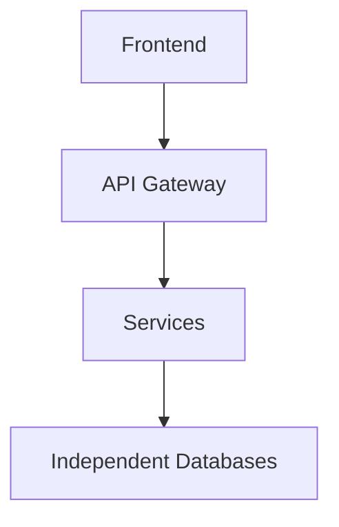

## Lessons From a Legacy Monolith

## Introduction

Several years ago, before I started working with modern distributed systems and microservice architectures, I had the opportunity to work on a large enterprise platform used by hundreds of organizations and thousands of suppliers.

At the time, I didn't fully understand how architectural decisions impact systems over the long term. Working on this platform exposed me to many real-world problems that large legacy systems face when they grow without architectural evolution.

This repository documents the engineering lessons I learned from that experience.

## System Context

The platform was responsible for managing complex workflows between organizations and suppliers.

Systems of this nature typically include features such as:

- supplier registration
- procurement processes
- contract management
- validation workflows
- reporting and auditing

Because these systems support critical business operations, they tend to grow over many years and accumulate large amounts of functionality.

## Original Architecture

The system was built as a large monolithic application.

All functionality lived inside a single codebase and shared the same database.

Typical structure:

## How the System Evolved

Over time, the system continued to grow but its architecture never evolved.

New regulations, business requirements, and features were continuously added to the same codebase.

Instead of introducing architectural boundaries, new logic was often implemented directly inside existing modules.

As a result:

- the codebase became increasingly complex
- dependencies between modules grew
- technical debt accumulated
- scalability problems started to appear

## Example: Spaghetti Code

One of the patterns commonly found in the system was deeply nested validation logic.

This pattern emerged when business rules were continuously added to the same functions without refactoring or modularization.

## Technical Problems Observed

1. Deeply Nested Logic
   - large conditional blocks
   - hard to read
   - hard to modify
     
2. Tight Coupling
   - modules depended heavily on each other
   - small changes had unpredictable consequences

3. Scalability Issues
   - each instance of the application required large CPU and memory resources
   - the entire system had to be scaled together
     
5. Growing Technical Debt
   - duplicated logic
   - large functions
   - difficult refactoring
  
## Lessons Learned

   - Architecture matters: Without clear architecture boundaries, complexity grows exponentially.
   - Systems must evolve: A system that never evolves architecturally will eventually become difficult to maintain.
   - Avoid large functions: Smaller components are easier to test and reason about.
   - Invest in maintainability early: Refactoring and architecture improvements should be continuous.

## What I Would Do Differently Today

If I were designing a similar system today, I would focus on:

- domain boundaries
- service-oriented architecture
- automated testing
- observability
- scalability

Modern architectures such as microservices provide better foundations for long-term system evolution.

## Final Thoughts

 - Legacy systems are not failures.
 - They are often the result of years of evolution under real-world constraints.
 - However, they also highlight the importance of architecture, maintainability, and continuous technical evolution.
 - The lessons learned from maintaining large legacy systems are some of the most valuable experiences a software engineer can have.
